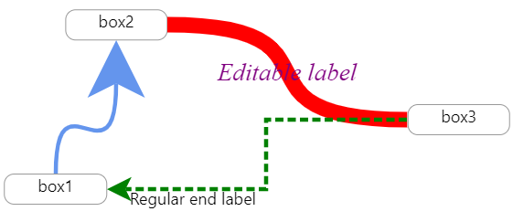
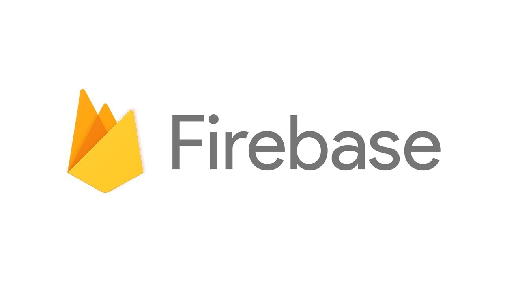

# [kube-form](https://kube-form.web.app/)

<p align="center">
    <a href="https://kube-form.web.app/">
        
    </a>
    <h3 align="center">
        <a href="">Visit the live app</a>
    </h3>
    
</p>
<p align="center">
    <a href="https://github.com/kube-form/kube-form-FE/issues"></a>
    <a href="https://github.com/kube-form/kube-form-FE/blob/master/README.md">
    
    </a>
    
    
    
    
</p>

## 🗂 Contents

-   [Features](#-features)
-   [About](#-about)
-   [Install](#-install)
-   [Author](#-author)
-   [Acknowledgements](#-acknowledgements)
-   [Contributing](#-contributing)
-   [License](#-license)

## 🎉 Features

-   **react-beautiful-dnd 라이브러리를 사용하여 Drag & Drop 기능을 구현**
    
    <br/><br/>
    사용자가 직접 구성하기 어려운 AWS 인프라 생성과정과 Cluster 구성을 손쉽게 만들어 주기 위해 UI/UX 디자인을 고려하여 Drag & Drop 기능을 접목시켰습니다.

    -   원활한 Drag & Drop기능 구현을 위해 react-beautiful-dnd 라이브러리 활용
        -   따로 Touch 및 Drag, Drop event를 구현하지 않아도 됨.
        -   Drag & Drop으로 virtual list 구조에 손쉽게 요소들을 추가, 제거 가능함.
        -   Drag 중인 Item들의 애니메이션 및 이동이 사용자에게 보기 좋음.
    -   각종 컴포넌트들의 세부 디자인에는 @mui/material 라이브러리 사용
    -   위 이미지와 같은 컴포넌트 구조로 구성되어 있으며, 웹 사이트 내에 구현해 둔 DND(Drag and Drop) 기능을 사용하여 사용자가 원하는 도커 이미지를 손쉽게 워커 노드에 옮겨 넣어 아키텍처를 구성하도록 했습니다.

    <br/>

-   **Cluster 구성 디자인에서 각 Node들을 연결해주는 Line 구현**
    <br/><br/>

    -   Container Image들 사이에 의존 관계를 표현하기 위해 Xarrow 패키지를 이용해 시각적인 간결성과 용이성을 높였습니다.
        -   각 Container Image들은 서버에서 받아온 고유한 id로 구분됩니다.
        -   다른 worker node에 있는 Container Image들은 같은 Ingress Controller로 묶여 이후 서버에 요청을 보낼 때 각 Container Image replicas로 반영됩니다.

    <br/>

-   **Firebase 이용한 유저 관리 및 호스팅**
    <br/><br/>

    -   Firebase에서 제공하는 제품으로 프로젝트를 구성했습니다.
        -   Authentication: Google Login을 붙여 유저를 관리했습니다.
        -   Google Analytics: 사용자의 접속 및 통계를 확인했습니다.
        -   Hosting: Github actions을 붙여 CI/CD를 구성했습니다.

    <br/>

-   **SWR 이용한 서버 통신 관리**
    <br/><br/>

    -   SWR 패키지를 이용해 요청 중복을 제거하고 포커스시 재검증, 네트워크 회복시 재검증 등 서버와의 통신에서 정확성과 안정성 측면을 높였습니다.

## 📖 About


## 🚘 Install

Clone and install.

```
git clone https://github.com/kube-form/kube-form-FE.git
cd kube-form-FE
npm i
```

Create `.env`

```
# .env

# FIREBASE
REACT_APP_FIREBASE_EMAIL=
REACT_APP_FIREBASE_APIKEY=
REACT_APP_FIREBASE_AUTHDOMAIN=
REACT_APP_FIREBASE_PROJECTID=
REACT_APP_FIREBASE_STORAGEBUCKET=
REACT_APP_FIREBASE_MESSGINGSENDERID=
REACT_APP_FIREBASE_APPID=
REACT_APP_FIREBASE_MEASUREMENTID=

# SERVER
REACT_APP_PROXY=

# AWS
REACT_APP_AWS_ACCESSKEY=
REACT_APP_AWS_SECRETKEY=
REACT_APP_AWS_REGION=
REACT_APP_AWS_BUCKET=
REACT_APP_AWS_KEYID=
```

Run a development server.

```
npm start
```

## 😀 Author

-   [정동하](https://github.com/ha4219)
-   [권영재](https://github.com/dwdjjj)

## ✅ Acknowledgements

-   좋은 추억 만들어주신 [OIDC](https://oidc.co.kr/home) 주최자분들께 감사 인사드립니다.

## 🌋 Contributing

-   I will not be accepting PR's on this repository. Feel free to fork and maintain your own version.

## 📄 License

-   This project is open source and available under the [MIT License](LICENSE).
