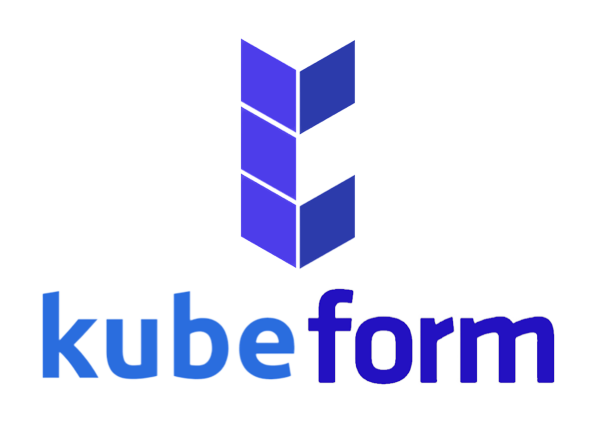
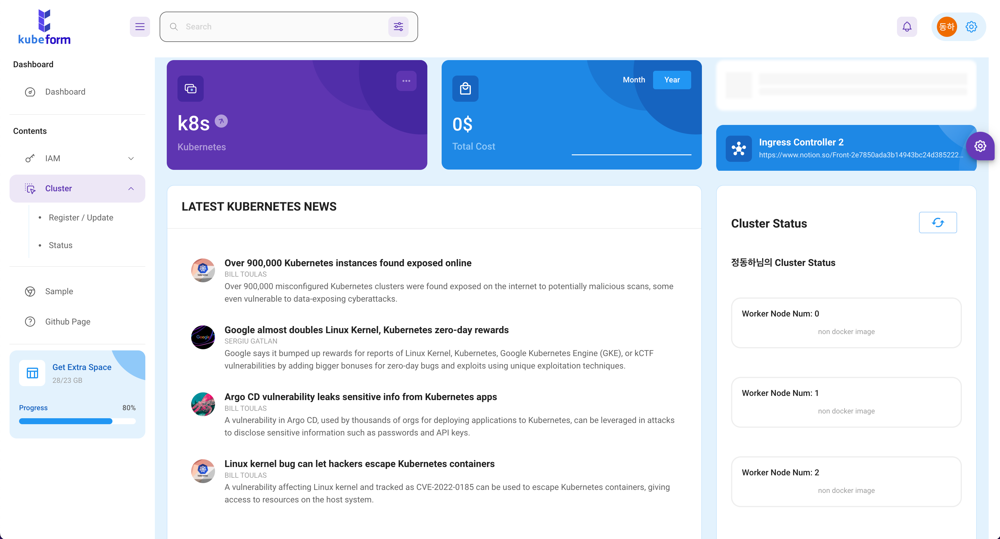

# [kube-form](https://kube-form.web.app/)

<p align="center">
    <a href="https://kube-form.web.app/">
        
    </a>
    <h3 align="center">
        <a href="https://kube-form.web.app/">Visit the live app</a>
    </h3>
    
</p>
<p align="center">
    <a href="https://github.com/kube-form/kube-form-FE/issues"></a>
    <a href="https://github.com/kube-form/kube-form-FE/blob/master/README.md">
    
    </a>
    
    
    
    
</p>

## 🗂 Contents

-   [Features](#-features)
-   [About](#-about)
-   [Install](#-install)
-   [Author](#-author)
-   [Task](#-task)
-   [Release](#-release)
-   [License](#-license)

## 🎉 Features

-   **Login** - Social Login by firebase

    -   Firebase를 활용해 인증과 통신을 진행하고, 구글만 로그인 제공업체로 사용함.

-   **Drag and drop** - drag a Container Image to Worker Node

    -   react-beautiful-dnd 라이브러리를 사용하여 Drag & Drop 기능을 구현함.
        
        위 이미지와 같은 컴포넌트 구조로 구성되어 있음.
        -   웹 사이트 내에 구현해 둔 드래그 기능을 사용하여 사용자가 원하는 도커 이미지를 보기 좋게 워커노드에 옮겨 넣어 아키텍쳐를 구성하도록 함.

-   **Register and Check Status** - API
    -   서버에 전달하고, 요청할 데이터들을 SWR을 활용하여 통신함.
        
    -   DND(Drag and Drop)로 구성된 클러스터 정보들을 json형태로 변환하여 서버로 전달함.
        이때, 사용자의 IAM 유저와 함께 전달한다.

## 📖 About



## 🚘 Install

Clone and install.

```
git clone https://github.com/kube-form/kube-form-FE.git
cd kube-form-FE
npm i
```

Run a development server.

```
npm start
```

## 😀 Author

-   [정동하](https://github.com/ha4219)
-   [권영재](https://github.com/dwdjjj)

## ✅ Acknowledgements

-   좋은 추억 만들어주신 [OIDC](https://oidc.co.kr/home) 주최자분들께 감사 인사드립니다.

## 🌋 Contributing

-   I will not be accepting PR's on this repository. Feel free to fork and maintain your own version.

## 📄 License

-   This project is open source and available under the [MIT License](LICENSE).
